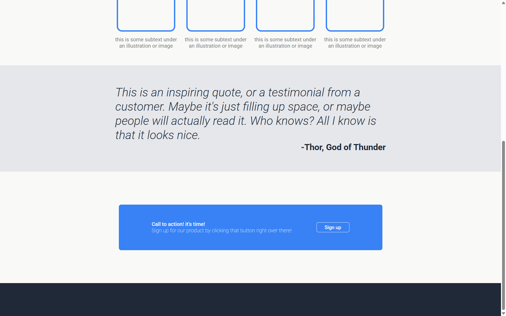

# 🌐 Landing Page (HTML & CSS)

A simple landing page project built as part of my web development practice.  
This project helped me strengthen my basics of **HTML & CSS** while experimenting with layouts, typography, and styling.  

---

## 🔧 Tech Stack
- **HTML5**
- **CSS3**

---

## ✨ Features
- Clean header with navigation bar
- Sections
- Basic responsive layout (adjusts on smaller screens)  
- Footer

---

## 📸 Screenshots
(assets/screenshots/landing-page-part2.png)

---

